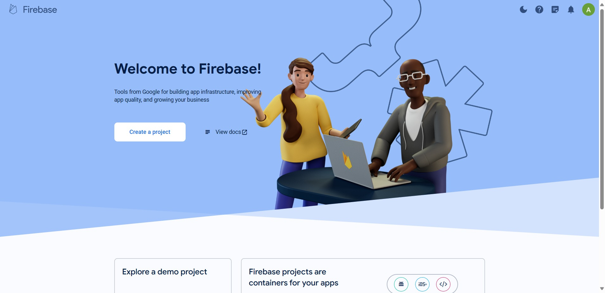
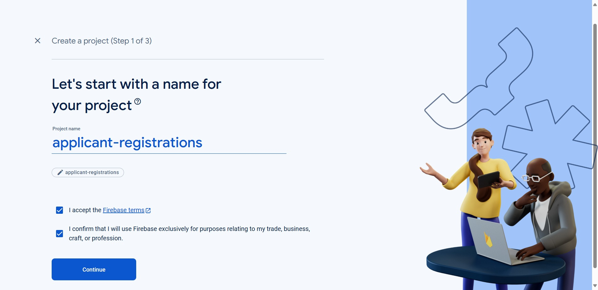

# Django with Firebase

Building a Seamless Django Application Integrated with Firebase: Empowering Users to Create Accounts, Log In with Username and Password, Log Out, Reset Passwords, and Effortlessly Store and Retrieve Data and Media Files (.jpg, .png, .pdf, .docx).

## Functionality

- Create an account
- Log in via username & password
- Log out
- Reset password
- Store and retrieve data from Firebase
- Store and retrieve media (.jpg, .png, .pdf, .docx) from Firebase

## Setup Firebase

### Create Project

| Click on Create Project | Enter Project Name | Enable Analytics |  Choose Analytics Location|
| -------------|-------------------|------------|------------|
||   | |  |

### Create Application

| Click on Continue | Add Application | Register App | Firebase SDK |
| -------------|-------------------|------------|------------|
|   | |  |  |

### Create Realtime Database

| Build - Realtime Database | Create Database | Choose Database Location | Security Rules |
| -------------|-------------------|------------|------------|
|   | |  |  |

### Create Storage

| Build - Storage | Create Storage | Security Rules | Choose Location |
| -------------|-------------------|------------|------------|
|   | |  |  |

### Storage Rules and Authentication

| Storage Rules | Build - Authentication | Choose Sign Provider | Enable Sign-in  |
| -------------|-------------------|------------|------------|
|   | |  | 


## Installing

### Clone the project

```bash
git clone https://github.com/shivatejaburle/django-with-firebase
cd django-with-firebase
```

### Setup your Virtual Environment
```bash
pip install virtualenv
virtualenv venv
# For Windows
venv\Scripts\activate   
# For Mac
source venv/bin/activate 
```

### Install dependencies
```bash
pip install -r requirements.txt
```

### Environment Settings

Create `django-with-firebase/.env` to store Firebase Configurations.

```bash
API_KEY = "Your-API-Key"
AUTH_DOMAIN = "AUTH_DOMAIN"
PROJECT_ID = "PROJECT_ID"
STORAGE_BUCKET = "STORAGE_BUCKET"
MESSAGING_SENDER_ID = "MESSAGING_SENDER_ID"
APP_ID = "APP_ID"
DATABASE_URL = "DATABASE_URL"
```

### Apply migrations

```bash
python manage.py migrate
```
### Collect static files (only on a production server)

```bash
python source/manage.py collectstatic
```

### Running a development server

Just run this command:

```bash
python manage.py runserver
```

## Screenshots

| Landing Page | Create an Account in Firebase | Login Page |
| -------------|-------------------|------------|
||   | |

| Home Page | Submit Application (with Image) | Submission Success |
| -------------|-------------------|------------|
||   | |

| View Application (with Image) | Submit Application (with PDF) | View Application (with PDF) |
| -------------|-------------------|------------|
||   | |

| Submit Application (with DOCX) | View Application (with DOCX) | View DOCX |
| -------------|-------------------|------------|
||   | |

| Data at Firebase Realtime Database | Media at Firebase Storage | Reset Password |
| -------------|-------------------|------------|
||   | |